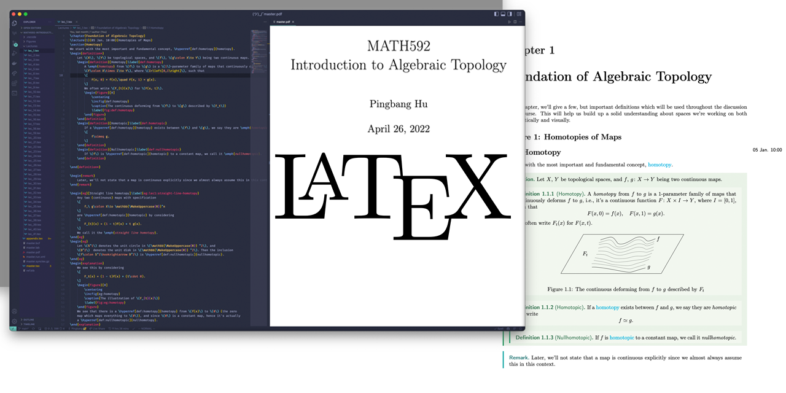

# LaTeX Template

	

<b><i>
	LaTeX Templates I used 📝
</i></b>

## Abstract

The existing $\LaTeX$ templates are often over-complicated, while I try to make them simple and unified. There are four templates you might need:

- [Note](./Note)
- [Report/Assignment](./Report)
- [Beamer](./Beamer)
- [Resume](./Resume)
- [Letter](./Letter)

> If you're interested in my LaTeX typeset setup, check out [this repo](https://github.com/sleepymalc/VSCode-LaTeX-Inkscape).

## About Honor Code

### UM-SJTU Joint Institute

According to the SJTU student handbook (2019 version),

> It is a violation of the Honor Code for students to submit, as their own, work that is not the result of their own labor and thoughts. This applies, in particular, to ideas, expressions or work obtained from other students as well as from books, the internet, and other sources. The failure to properly credit ideas, expressions or work from others is considered plagiarism.

### University of Michigan

According to the UM [Academic Rules, Rights, and Responsibilities](https://bulletin.engin.umich.edu/rules/),

> It is always required that ideas and materials obtained from another student or from any other source be acknowledged in one’s work. The latter is particularly important, because material is so freely available on the Internet. According to Merriam-Webster online dictionary, to plagiarize is “To steal and pass off (the ideas or words of another) as one’s own.” To avoid plagiarism, it is necessary to cite all sources of both ideas and direct quotations, including those found on the Internet.

## Contribution

The works are partially contributed by some other students, TAs, and professors, which would be listed if known.
> If you find any problems in the repository, welcome to make an issue or pull request.
